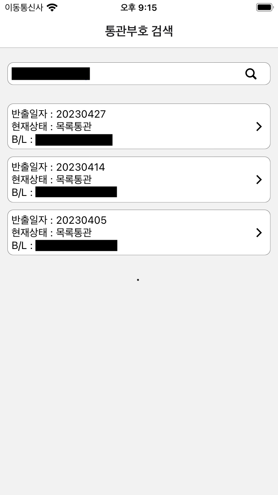
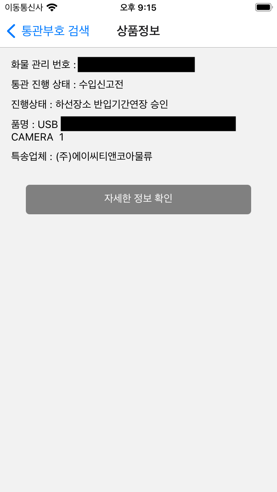
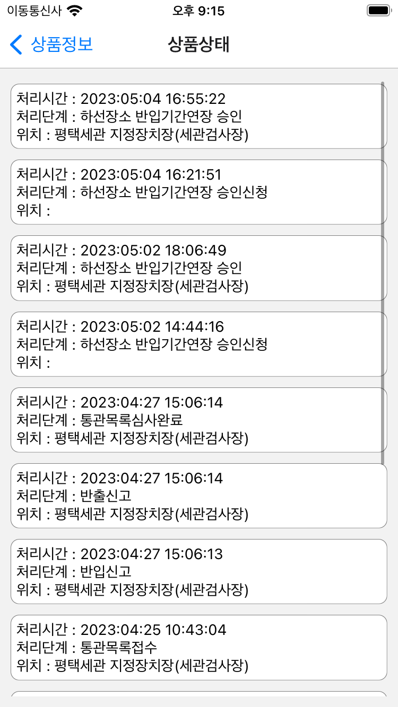

# 통관물품 검색 어플리케이션

## 사용된 프레임워크
- React Native

## 목표
통관부호를 사용해서 물품 검색 및 조회

## 플로우
```text
검색과 물품 리스트 : 뷰
└── 물품의 전체정보 & 물품의 시간대별 간단 정보 : 뷰
    └── 시간대별 자세한 정보 : 모달
```

## 환경변수
.env 파일에 작성

- DETAIL_API_URL
- LIST_API_URL

## 동작화면
<div style="display: flex">
    
    
</div>
<div style="display: flex">
    
    
</div>